# Transferencia e primeiro contato do vendedor

Este documento descreve a fonte de verdade usada para responder a duas perguntas diferentes:

1. O vendedor confirmou o recebimento do lead?
2. Depois da confirmacao, ele realmente enviou uma mensagem ao lead pelo WhatsApp conectado?

Esses fatos nao devem ser inferidos pela interface nem pela quantidade de mensagens carregadas na tela. Eles sao calculados a partir dos registros operacionais do banco.

## Fluxo de dados

```mermaid
flowchart LR
  A["Transferencia pendente em ai_lead_transfers"] --> B["Vendedor responde OK"]
  B --> C["Webhook identifica a pessoa vendedora"]
  C --> D["CRM recebe assigned_to_id"]
  D --> E["Transferencia recebe confirmed_at"]
  E --> F["Vendedor envia mensagem pela instancia conectada"]
  F --> G["Mensagem outgoing em wa_inbox"]
  G --> H["RPC calcula o primeiro contato apos o OK"]
  H --> I["Inbox exibe tempo real ou estado de espera"]
```

## 1. Criacao e confirmacao da transferencia

A transferencia fica registrada em `public.ai_lead_transfers` com:

- `lead_id`: lead transferido;
- `to_member_id`: linha de `ai_team_members` escolhida para receber o lead;
- `transfer_status = 'pending'`;
- `is_confirmed = false`.

Quando uma mensagem reconhecida como confirmacao chega do numero do vendedor, a saga compartilhada de confirmacao:

1. resolve todas as linhas de vendedor correspondentes ao remetente;
2. encontra a transferencia pendente correta;
3. atribui o lead em `ai_crm_leads.assigned_to_id` antes de confirmar;
4. muda o CRM para `status = 'em_atendimento'`;
5. grava `transfer_status = 'confirmed'`, `is_confirmed = true` e `confirmed_at`;
6. expira transferencias irmas ainda pendentes para o mesmo lead.

Os caminhos principais estao em:

- `supabase/functions/_shared/pedro-v2/transferRouter.ts`;
- `supabase/functions/uazapi-webhook/index.ts`;
- `supabase/functions/confirm-lead-manual/index.ts` para confirmacao manual.

O nome historico `pedro-v2` do modulo compartilhado nao significa que a conversa volta ao agente v2. Ele e uma biblioteca operacional reutilizada pelo webhook para a saga de transferencia.

## 2. Identidade canonica do vendedor

Uma pessoa pode possuir mais de uma linha em `ai_team_members`, normalmente uma por agente. Portanto, `to_member_id` nao e sozinho a identidade completa da pessoa.

A identidade canonica e resolvida nesta ordem:

1. o proprio `to_member_id` da transferencia;
2. todas as linhas com o mesmo `auth_user_id`;
3. para registros antigos sem login uniforme, todas as linhas com o mesmo WhatsApp canonico (`logos_phone_key`).

Depois disso, todas as `wa_instances.seller_member_id` ligadas a qualquer uma dessas linhas representam os canais conectados daquela pessoa.

Regra importante: nenhum recurso novo deve consultar apenas `seller_member_id = to_member_id` para decidir se o vendedor esta conectado ou se falou com o lead. Deve usar o conjunto de linhas irmas.

## 3. Primeiro contato factual

A funcao `public.get_lead_seller_contact_status(p_lead_id)` e a autoridade unica da metrica.

Ela retorna:

- transferencia atual e horario do OK;
- vendedor e todas as linhas equivalentes;
- existencia e estado das instancias do vendedor;
- primeira mensagem `outgoing` enviada ao telefone do lead depois de `confirmed_at`;
- origem do fato (`wa_inbox` ou rede historica `wa_synced_messages`).

A busca usa:

1. `wa_inbox` como fonte primaria e em tempo real;
2. `wa_synced_messages` como fallback historico, apenas para mensagens de instancia do vendedor cuja autoria seja humana ou nao classificada.

O tempo mostrado no painel e:

`first_contact_at - confirmed_at`

Uma mensagem anterior ao OK nunca conta como primeiro contato daquela transferencia.

## 4. Estados exibidos no Inbox

O componente `src/components/pedro/AgentInboxTab.tsx` transforma o retorno da RPC em quatro estados:

- `contacted`: existe mensagem factual depois do OK;
- `awaiting_contact`: vendedor conectado, mas ainda sem mensagem registrada depois do OK;
- `seller_disconnected`: vendedor sem instancia conectada; contato externo nao pode ser medido;
- `checking`: o dado ainda esta sendo carregado e nao deve ser confundido com ausencia de contato.

Enquanto aguarda, o painel consulta novamente a metrica e tambem reage a novas linhas de `wa_inbox` e `wa_synced_messages`.

## 5. Caso real que motivou a correcao

No lead Dudu:

- confirmacao do vendedor: `31/07/2026 08:38:32` BRT;
- primeira mensagem do Luiz Felipe: `31/07/2026 08:38:45` BRT;
- tempo real: `13 segundos`.

O painel antigo mostrava aproximadamente 1h38 de espera porque a transferencia e a instancia estavam ligadas a duas linhas irmas do mesmo vendedor. A RPC nova resolve a pessoa antes de procurar suas mensagens.

## 6. Limites da metrica

A metrica prova uma mensagem enviada pelo WhatsApp conectado. Ela nao prova:

- ligacao telefonica;
- mensagem enviada por outro numero fora da plataforma;
- leitura ou resposta do lead;
- qualidade do atendimento.

Por isso, quando o vendedor esta desconectado, o painel informa que contatos feitos fora da plataforma nao sao mensuraveis em vez de afirmar que ele nao chamou o lead.

## 7. Regras para futuras alteracoes

- Nao duplicar `first_contact_at` em uma nova coluna: a mensagem original ja e a fonte de verdade.
- Nao calcular a metrica varrendo somente as mensagens renderizadas no navegador.
- Nao usar apenas um `ai_team_members.id` como identidade da pessoa.
- Sempre filtrar o primeiro contato por `created_at >= confirmed_at`.
- Manter a verificacao de tenant e de autorizacao dentro da RPC.
- Se novos canais de vendedor forem criados, adiciona-los como fonte explicita e auditavel; nao inferir contato por mudanca de status do CRM.
